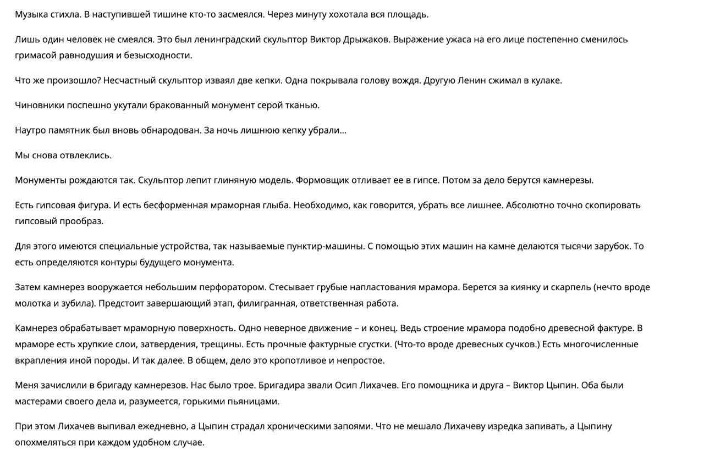

  

<em>Инфохимия</em>

<strong>Лабораторная работа №2  
По дисциплине : «Программирование» 
Отрывок из "Чемодана" Сергея Довлатова</strong>

Преподаватель: <strong>Райла Мартин</strong> 
Выполнил: <strong>Дьяконов Александр</strong> 
Группа: <strong>O3143</strong>

# Лабораторная работа #3

## 1. Задача
Переписать текст в виде объектно-ориентированной модели
## 2. Условия
Программа должна удовлетворять следующим требованиям:

    Доработанная модель должна соответствовать принципам SOLID.
    Программа должна содержать как минимум два интерфейса и один абстрактный класс.
    В разработанных классах должны быть переопределены методы equals(), toString() и hashCode().
    Программа должна содержать как минимум один перечисляемый тип (enum).

## 3. Исходный текст

  

## 4. Результат

## 5. UML

  

